% 펭귄 데이터 EDA 슬라이드
% 작성자: GitHub Copilot
% 날짜: 2025-12-23

# 타이틀

## 펭귄(Penguins) 데이터셋 EDA

- 작성자: GitHub Copilot
- 목표: 데이터 요약, 시각화, 통계표 및 각 시각화에 대한 한국어 인사이트 제공

---

## 개요

- 데이터 출처: seaborn의 `penguins` 데이터셋
- 이 슬라이드에서는 데이터셋 개요, 기술통계, 교차표/피벗테이블, 14개의 시각화(요약 포함)와 각 시각화별 인사이트를 제공합니다.

---

## 데이터셋 개요

- 원본 샘플 수: (344, 7)
- 결측치 제거 후 사용 샘플 수: (333, 7)
- 주요 변수: species, island, bill_length_mm, bill_depth_mm, flipper_length_mm, body_mass_g

---

## 기술통계 요약

```
{:.small}
|       |   bill_length_mm |   bill_depth_mm |   flipper_length_mm |   body_mass_g |
|:------|-----------------:|----------------:|--------------------:|--------------:|
| count |        333       |       333       |            333      |       333     |
| mean  |         43.9928  |        17.1649  |            200.967  |      4207.06  |
| std   |          5.46867 |         1.96924 |             14.0158 |       805.216 |
```

**인사이트:** 기술통계는 변수별 중심과 산포를 요약합니다. 평균과 중앙값 간 괴리나 큰 표준편차는 전처리(스케일링/로그변환/이상치 처리)의 필요성을 시사합니다.

---

## 교차표: 종별 vs 섬

```
| species   |   Biscoe |   Dream |   Torgersen |
|:----------|---------:|--------:|------------:|
| Adelie    |       44 |      55 |          47 |
| Chinstrap |        0 |      68 |           0 |
| Gentoo    |      119 |       0 |           0 |
```

**인사이트:** 특정 종이 특정 섬에 집중되어 있어 지리적 분포와 표본 편향을 고려해야 합니다. 섬을 통제변수로 포함한 분석을 권장합니다.

---

## 피벗: 종별-섬별 평균 체중 (g)

```
| species   |   Biscoe |   Dream |   Torgersen |
|:----------|---------:|--------:|------------:|
| Adelie    |  3709.66 | 3701.36 |     3708.51 |
| Chinstrap |   nan    | 3733.09 |      nan    |
| Gentoo    |  5092.44 |  nan    |      nan    |
```

**인사이트:** 동일 종이라도 섬에 따라 평균 체중 차가 있으므로 지역적 요인을 고려한 모델링이 필요합니다.

---

## 히스토그램: 부리 길이 & 부리 깊이

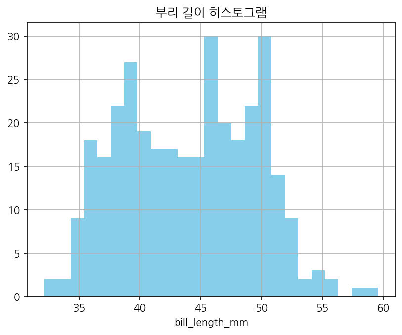

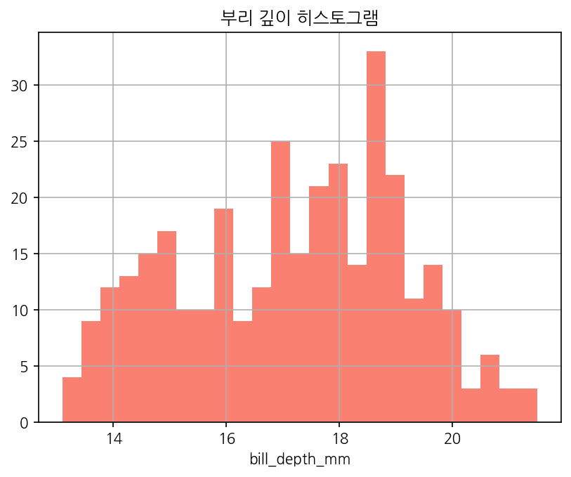

**인사이트:** 부리 길이는 40~50mm에 밀집하나 우측 꼬리가 있어 일부 긴 부리 집단(예: Gentoo)을 시사합니다. 부리 깊이는 비교적 좁은 범위로 종 식별에 유용합니다.

---

## 히스토그램: 지느러미 길이 & 체중

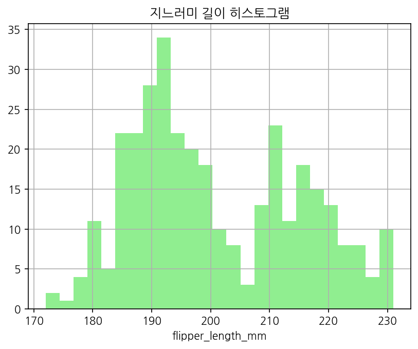

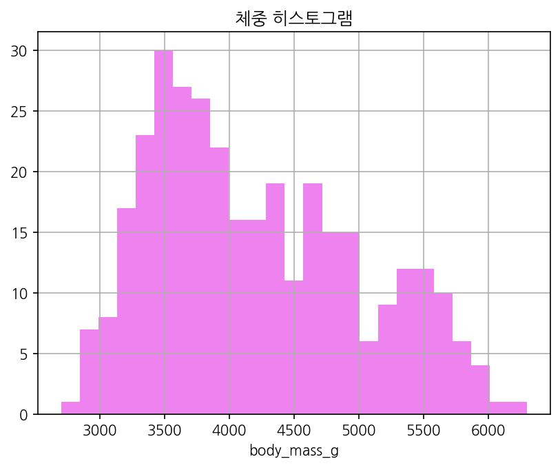

**인사이트:** 지느러미 길이와 체중은 종별 차이가 크며, 체중은 혼합형 분포를 보여 종별로 분리된 봉우리를 형성합니다. 지느러미 길이는 체중 예측에 유의미한 변수입니다.

---

## 산점도: 종별 부리 길이 vs 부리 깊이

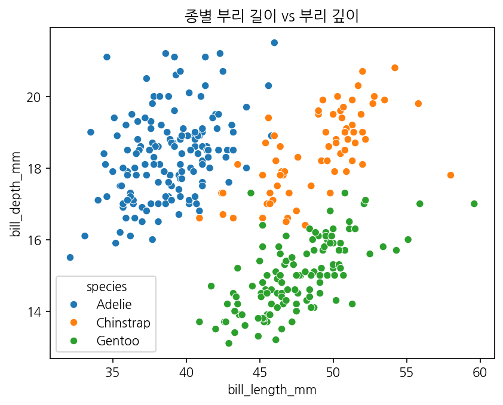

**인사이트:** 두 변수의 결합은 종을 구분하는 데 강력한 정보를 제공합니다. 종별 클러스터가 관찰되어 판별분석/분류모델에서 유용합니다.

---

## 산점도: 종별 지느러미 길이 vs 체중

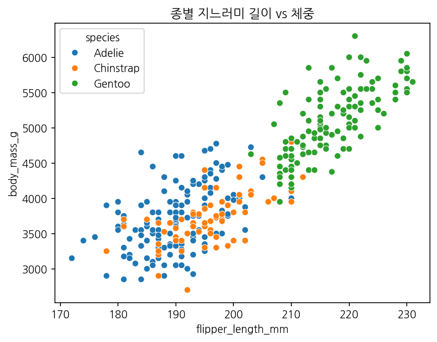

**인사이트:** 지느러미 길이와 체중은 양의 상관관계가 뚜렷하며, 종별로 기울기/절편이 달라 종별 모델링 또는 교호항 포함을 권장합니다.

---

## 박스플롯: 종별 체중

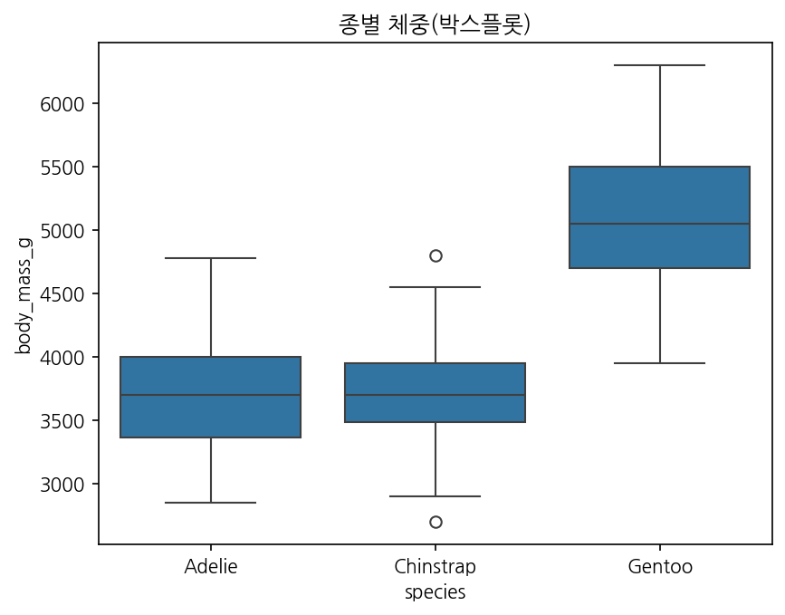

**인사이트:** Gentoo의 중앙값·IQR이 높아 체중이 큰 종임을 확인합니다. 그룹 간 유의성 검정(ANOVA) 및 효과크기 확인을 권장합니다.

---

## 바이올린: 종별 부리 길이

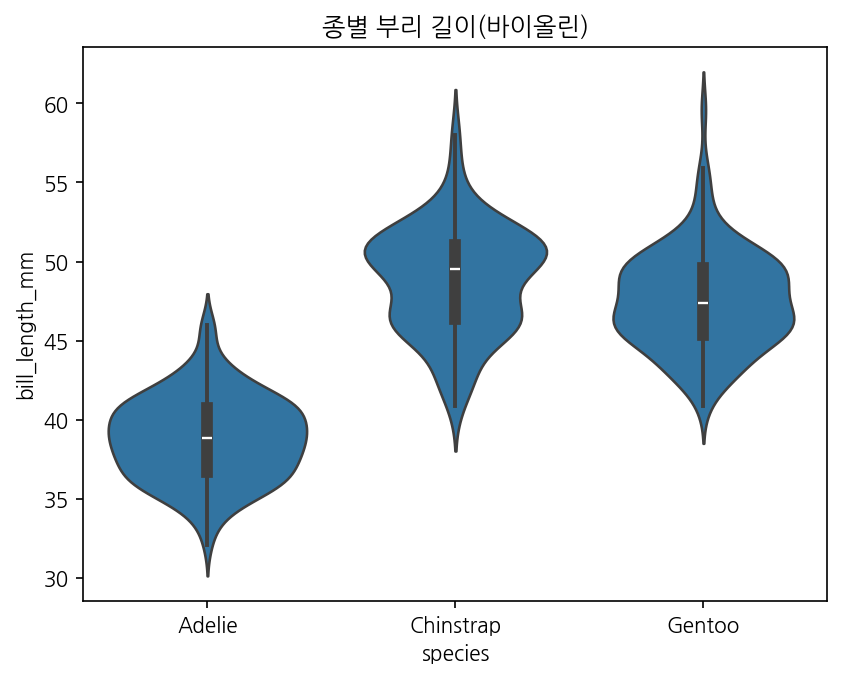

**인사이트:** 밀도 기반 분포 분석으로 종별 밀집 길이대를 확인할 수 있어 세부 패턴 탐색에 유리합니다.

---

## 막대그래프: 종별 개수

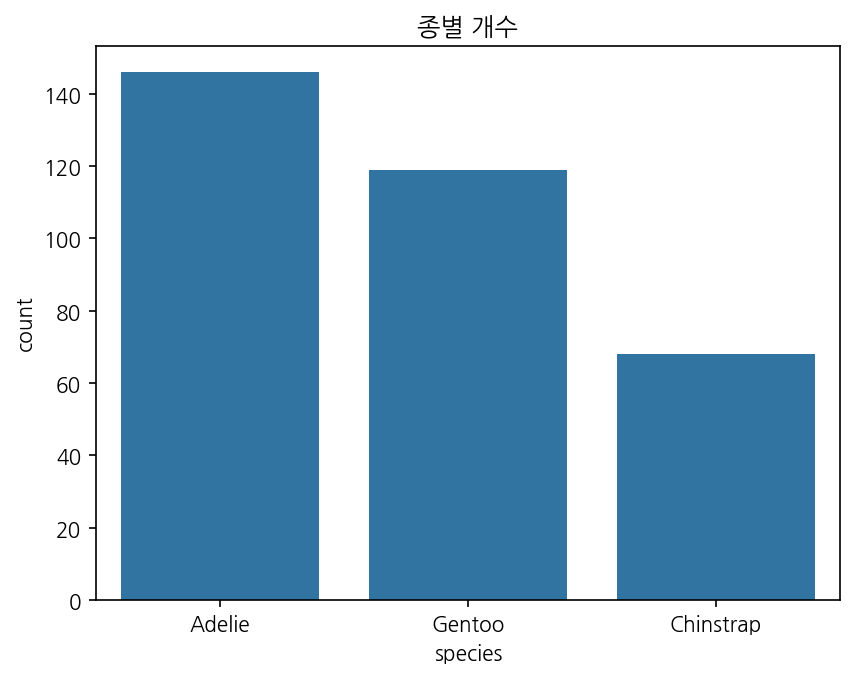

**인사이트:** 클래스 불균형을 확인할 수 있어 모델 학습 시 가중치나 오버/언더샘플링 전략을 고려해야 합니다.

---

## 막대그래프: 섬별 개수

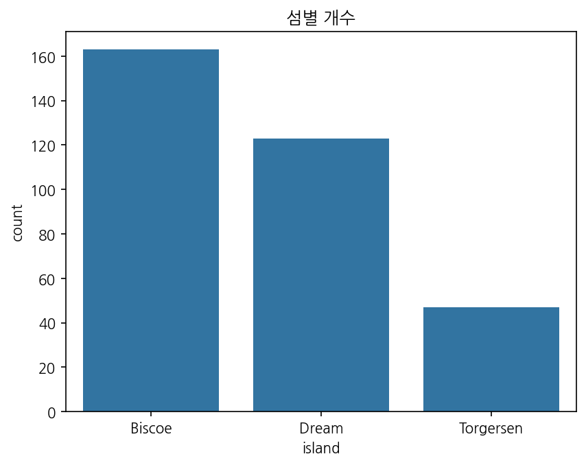

**인사이트:** 섬별 표본 수 편중이 있으므로 지역적 효과를 모델에 반영하거나 표본 가중치를 고려할 필요가 있습니다.

---

## 막대그래프: 종별 평균 체중 (±1 표준편차)

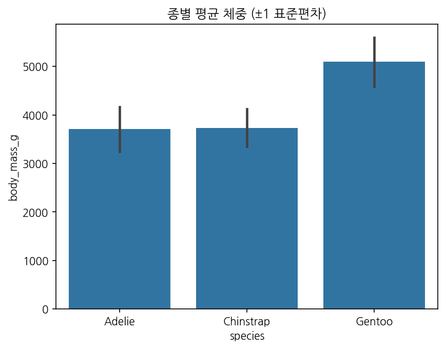

**인사이트:** Gentoo는 평균 체중이 높고 표준편차도 커 내부 변동성이 큼을 시사합니다. 평균 차이의 통계적 검정이 권장됩니다.

---

## 페어플롯: 수치 변수 상호관계

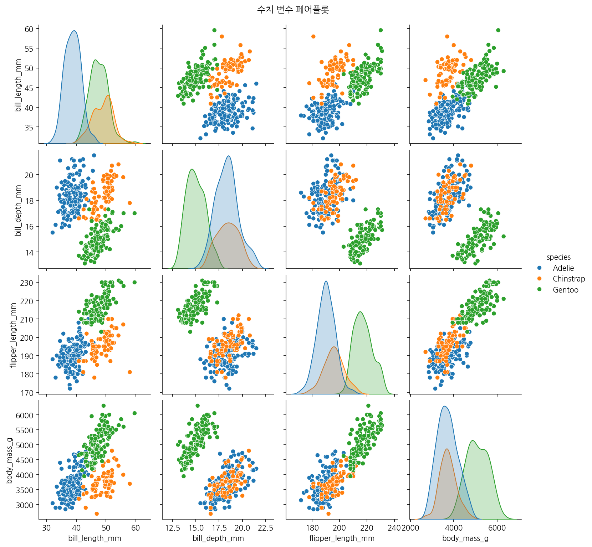

**인사이트:** 변수 간 양의 상관이 관찰되며 차원 축소(PCA) 또는 조합 피처 활용으로 분류 성능을 향상시킬 수 있습니다.

---

## 박스플롯: 종별 부리 깊이

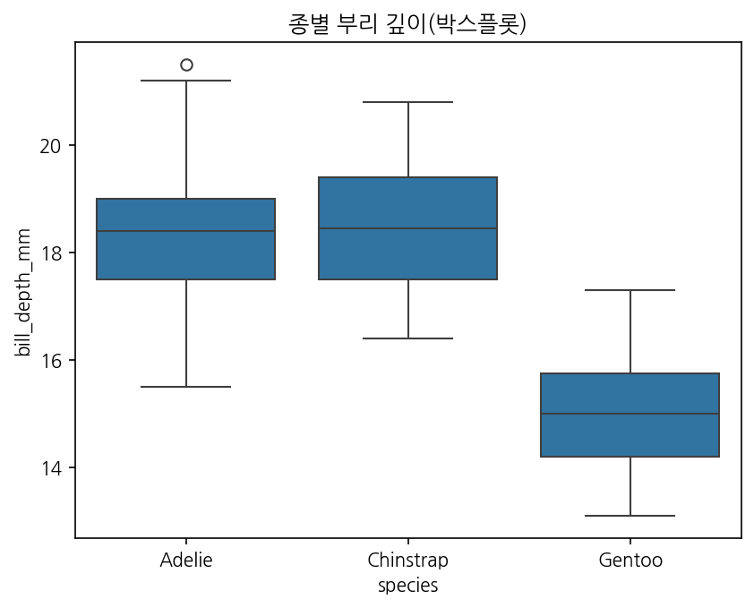

**인사이트:** 종간 중앙값 및 산포 차이가 있어 단일 변수로만 분류하기 어려운 경우 다변량 조합이 필요합니다.

---

## 회귀 플롯: 부리 길이 vs 지느러미 길이

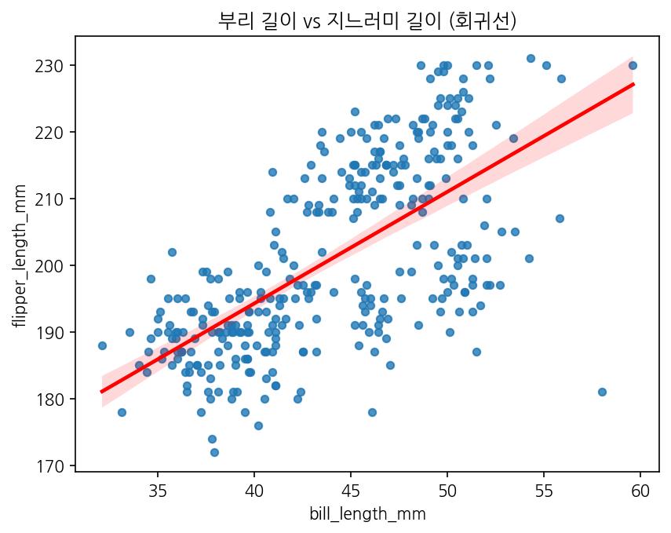

**인사이트:** 양의 선형관계가 관찰되며, 회귀모델의 R²와 잔차분석을 통해 관계의 강도를 정량적으로 평가할 수 있습니다.

---

## 결론 및 권장사항

- 부리 길이/깊이, 지느러미 길이, 체중의 조합은 종 분류에 유용합니다.
- 섬(지역) 변수를 통제하거나 혼합효과 모델을 고려하세요.
- 클래스 불균형 대응(가중치/샘플링)과 통계적 검정(ANOVA, 카이제곱)을 수행하세요.

---

## 부록: 실행 방법 및 파일 위치

- 분석 스크립트: `scripts/penguins_analysis.py`
- 출력: `outputs/report.md`, `outputs/report.docx`, `outputs/penguins_slides.pptx` (생성 예정)
- 실행: `python3 scripts/penguins_analysis.py`


